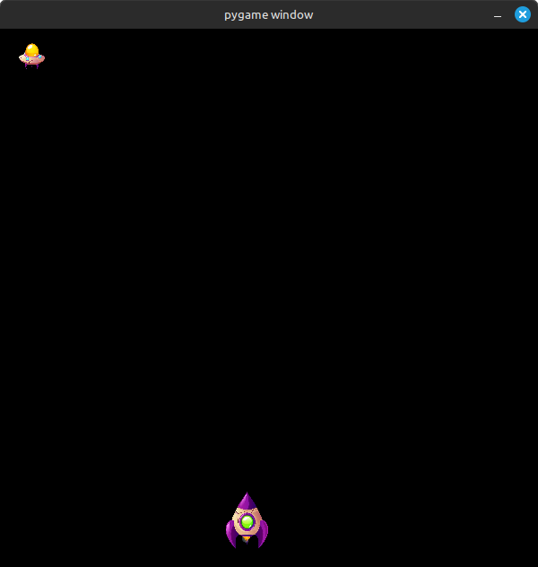

<h1>🚀 Space Shooter Game</h1>

Este é um game de tiro simples desenvolvido em Python, onde o jogador controla uma nave espacial com o objetivo de acertar uma nave inimiga. O jogo é básico, com uma mecânica inicial simples, mas pode ser facilmente incrementado com novas funcionalidades, como mais inimigos, níveis de dificuldade, e efeitos visuais.

<h3>🎮 Como Funciona</h3>

    O jogador controla uma nave espacial.
    O objetivo é acertar uma nave inimiga única.
    Simples e direto, ideal como base para expandir e aprender conceitos de desenvolvimento de jogos.

<h1>🛠️ Tecnologias Utilizadas</h1>

    Python
    [Biblioteca Pygame]

<h1>🌟 Ideias para Melhorias Futuras</h1>

    Adicionar múltiplos inimigos.
    Criar diferentes níveis de dificuldade.
    Implementar power-ups e habilidades para o jogador.
    Melhorar os gráficos e adicionar sons.

 
 
